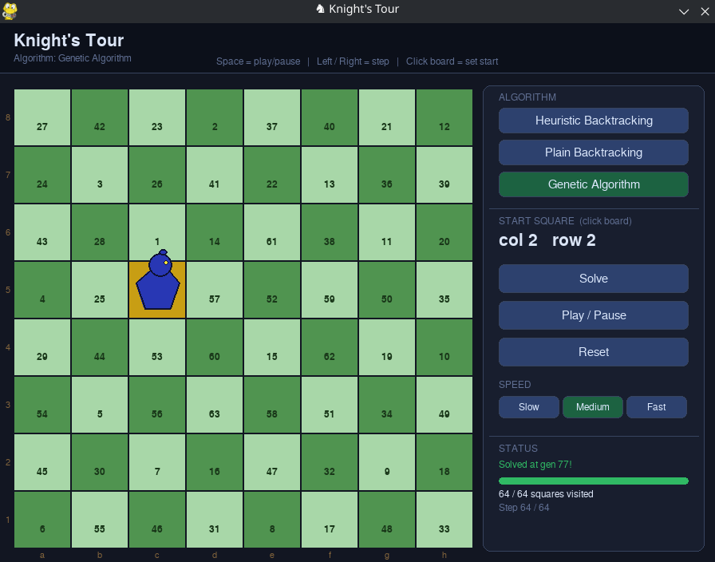

# ♞ Knight's Tour

> Can a chess knight visit every square on an 8×8 board exactly once? This project finds out — three different ways.

Built with Python, this project tackles the classic **Knight's Tour** problem using three algorithms: a near-instant heuristic solver, a brute-force backtracker, and an evolutionary genetic algorithm. All wrapped in a clean Pygame GUI with live animation.



---

## 🎯 Algorithms

### ⚡ Heuristic Backtracking (MRV + LCV)
Uses two CSP heuristics from constraint satisfaction theory:
- **MRV** — always move to the square with the *fewest* onward options
- **LCV** — break ties by keeping as many future options open as possible

Together these form an extended Warnsdorff's rule. Solves any starting square in under a millisecond with virtually no backtracking in practice.

### 🐢 Plain Backtracking
Straightforward recursive search with no move ordering. Explores branches in a fixed order and backtracks on dead ends. Correct but exponentially slow — included as a baseline to illustrate the impact of heuristic ordering.

### 🧬 Genetic Algorithm
Evolves a population of candidate tours across many generations using crossover, mutation, and tournament selection. Each chromosome encodes 63 moves (one per gene, direction 1–8). A repair decoder handles invalid moves locally without modifying the chromosome, keeping crossover and selection meaningful. The GUI displays the best path found updating live each generation.

---

## 🗂️ Project Structure

```
Knights-Tour/
│
├── images/             # GUI screenshot
│   └── demo.png
│
├── knights_tour.py     # All three solvers — no GUI dependency
└── gui.py              # Pygame visualization
```

---

## 🚀 Getting Started

```bash
pip install pygame
python gui.py
```

To run the solvers directly from the terminal:

```bash
python knights_tour.py
```

---

## 🖥️ GUI Controls

| Control | Action |
|--------|---------|
| 🖱️ Click a square | Set the start position |
| `Solve` | Run the selected algorithm |
| `Space` | Play / pause animation |
| `→` / `←` | Step forward / backward |
| `R` | Reset the board |
| `Slow` / `Medium` / `Fast` | Control animation speed |

The solver runs in a background thread — the GUI stays responsive during computation.

---

## 📊 How They Compare

| | ⚡ Heuristic BT | 🐢 Plain BT | 🧬 Genetic Algorithm |
|---|---|---|---|
| Always finds full tour | ✅ | ✅ (given time) | ❌ probabilistic |
| Speed | < 1 ms | Minutes to never | Seconds to minutes |

---

## 🛠️ Built With

- **Python 3.8+**
- **Pygame** — GUI and animation

---

## 📄 License

This project is licensed under the [MIT License](LICENSE).
